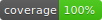

[![style: very good analysis][very_good_analysis_badge]][very_good_analysis_link]
[](https://github.com/felangel/mason)
[![License: MIT][license_badge]][license_link]


An extendable logger library with colorful prints.

## Basic Usage 🚀

You can log messages with different levels of severity.

The default levels are the following:

- fine
- info
- config
- warning
- shout

To log a message at level info with the default logger:

```dart
logInfo('Hello there!');
```

This prints this message to the console.
> [Logger - INFO] Hello there

Create a logger and use it to log messages.

```dart
final logger = CleverLogger('Test Logger');
// now you can use this logger
logger.logFine('Hello there!');
```

## Advanced Usage 🧪

### Log Actions

Log actions are responsible for what happens with the logs (for example storing them in a file or sending them to your analytics service).

The `LogRecords` are passed to the actions in order. By default, the logger uses a `ColorfulPrintAction` as its default action, which is responsible for colorful outputs to the console.

```dart
final otherLogger = CleverLogger(
  'Other Logger',
  logActions: [
    // The default colorful console output.
    ColorfulPrintAction(),
    // A custom action
    MyLogAction(),
  ],
);
```

Log actions can also be configured to only run for logs with a certain level.

```dart
class MyLogAction extends LogAction {
  @override
  Level get level => Level.INFO;

  @override
  void onRecord(LogRecord record) {
    //This is only executed for logs with a level >= Level.info
    print('${record.loggerName} has a log with ${record.level}');
  }
}
```

### Extending functionality

You can write extension methods to extend the loggers functionality.
Additional values can be stored in the `value` variable of the logger.

By default, the logger has a **Stopwatch** integrated as an extension.

See the example for more information.

### Custom Printer

Extend the `ColorfulPrintAction` and override the default print functions, like `printInfo`, `printWarning` etc. for custom-styled print messages.

You can use the [ansicolor](https://pub.dev/packages/ansicolor) plugin for colorful prints.

[license_badge]: https://img.shields.io/badge/license-MIT-blue.svg
[license_link]: https://opensource.org/licenses/MIT
[very_good_analysis_badge]: https://img.shields.io/badge/style-very_good_analysis-B22C89.svg
[very_good_analysis_link]: https://pub.dev/packages/very_good_analysis
